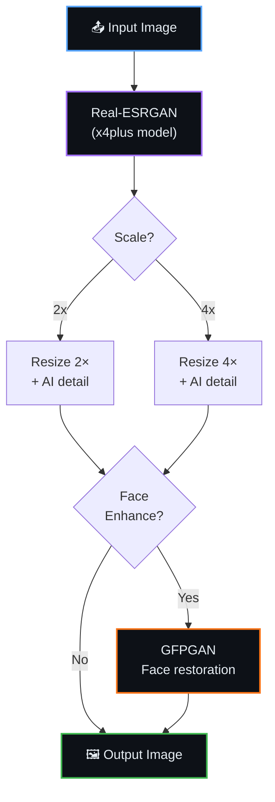

<div align="center">


<br/>

[](https://colab.research.google.com/github/Shineii86/ZImageUpscaler/blob/main/notebook/ZImageUpscaler.ipynb)
[](GUIDE.md)

<br/>

[](https://github.com/Shineii86/ZImageUpscaler/stargazers)
[](https://github.com/Shineii86/ZImageUpscaler/network/members)
[](https://github.com/Shineii86/ZImageUpscaler/issues)
[](https://github.com/Shineii86/ZImageUpscaler/commits/main)
[](https://github.com/Shineii86/ZImageUpscaler)

<br/>

[](https://github.com/xinntao/Real-ESRGAN)
[](https://colab.research.google.com)
[](https://www.python.org/)
[](LICENSE)

<br/>

**No setup. No install. No GPU? No problem.**

Open notebook in Google Colab, set runtime to T4, and run — it's that simple.

**Tags:** `image-upscaling` `real-esrgan` `super-resolution` `face-enhancement` `colab-notebook` `python` `ai-upscaler`

</div>

---

## 📑 Table of Contents

<details open>
<summary><b>Quick Navigation</b></summary>

<br/>

| Section | Description |
|:--------|:------------|
| [📖 Overview](#-overview) | What is Z-Image Upscaler? |
| [📂 Project Structure](#-project-structure) | Repository layout |
| [🧩 Architecture](#-architecture) | Pipeline flow diagram |
| [⚙️ Pipeline Components](#️-pipeline-components) | Models and tools used |
| [🚀 Quick Start](#-quick-start) | Get running in 3 steps |
| [🎛️ Upscale Parameters](#️-upscale-parameters) | All configurable options |
| [📐 Scale Guide](#-scale-guide) | When to use 2x vs 4x |
| [🧠 Model Details](#-model-details) | Technical specs of each model |
| [🔋 Resource Requirements](#-resource-requirements) | GPU, RAM, disk specs |
| [🐍 Python Modules](#-python-modules) | Modular source code reference |
| [🧪 Tips & Tricks](#-tips--tricks) | Get the best results |
| [❓ FAQ](#-faq) | Common questions answered |
| [🐛 Troubleshooting](#-troubleshooting) | Fix common issues |
| [🙏 Acknowledgements](#-acknowledgements) | Credits and references |
| [🤝 Contributing](#-contributing) | How to contribute |
| [📜 License](#-license) | MIT license details |

</details>

---

## 📖 Overview

Z-Image Upscaler is an **AI-powered image enhancement tool** using Real-ESRGAN. Upscale photos, anime, and illustrations at 2x or 4x with optional face enhancement — all on Google Colab's free T4 GPU.

> [!NOTE]
> **Why Real-ESRGAN?** Real-ESRGAN (Enhanced Super-Resolution Generative Adversarial Network) is the state-of-the-art for practical image upscaling. It handles photos, anime, and illustrations with a single model — no per-image tuning needed.

### ✨ Key Features

| Feature | Description |
|---------|-------------|
| 🔍 **4x Upscale** | Make images 4× larger with AI-generated detail |
| 🎨 **Dual Models** | General (photos) + Anime (illustrations) |
| 👤 **Face Enhance** | Optional GFPGAN for portrait enhancement |
| ⚡ **FP16 Fast** | Half-precision on supported GPUs — 2× faster |
| 🧩 **Tile Mode** | Auto-fallback for low VRAM — never OOM |
| 📦 **Batch Mode** | Upscale multiple images in one run |
| 💾 **Smart Cache** | Models cached in Google Drive — instant on restart |
| 🎯 **One-Click** | Zero configuration — just open and run |

### 📦 What's Included

| Component | File | Purpose |
|-----------|------|---------|
| **Notebook** | `notebook/ZImageUpscaler.ipynb` | 3-cell Colab notebook — main entry point |
| **Config** | `src/config.py` | Constants, model URLs, defaults |
| **Downloader** | `src/downloader.py` | aria2c model fetcher with Drive cache |
| **Upscaler** | `src/upscaler.py` | Real-ESRGAN loader + upscale engine |
| **Exporter** | `src/exporter.py` | Zip and download upscaled images |
| **Guide** | `GUIDE.md` | Beginner-friendly user guide |

---

## 📂 Project Structure

```
ZImageUpscaler/
├── CHANGELOG.md              # Version history (newest first)
├── CONTRIBUTING.md           # How to contribute
├── GUIDE.md                  # Beginner-friendly user guide
├── LICENSE                   # MIT
├── README.md                 # This file
├── SECURITY.md               # Vulnerability reporting policy
├── .gitignore                # Python, Jupyter, model files, OS artifacts
├── requirements.txt          # Python dependencies
│
├── .github/
│   ├── ISSUE_TEMPLATE/
│   │   ├── bug_report.md
│   │   └── feature_request.md
│   └── PULL_REQUEST_TEMPLATE.md
│
├── notebook/
│   └── ZImageUpscaler.ipynb  # Main Colab notebook (3 cells)
│
└── src/
    ├── __init__.py            # Package marker + shared logger
    ├── config.py              # Constants and defaults
    ├── downloader.py          # Model download engine
    ├── upscaler.py            # Real-ESRGAN upscale engine
    └── exporter.py            # Output zip + download helper
```

---

## 🧩 Architecture



---

## ⚙️ Pipeline Components

| Component | Model | Size | Purpose |
|-----------|-------|------|---------|
| **Real-ESRGAN x4plus** | RRDBNet (23 blocks) | ~65 MB | General-purpose 4x upscaler |
| **Real-ESRGAN Anime** | RRDBNet (6 blocks) | ~18 MB | Lightweight anime/illustration upscaler |
| **GFPGAN v1.3** | GFPGAN | ~340 MB | Face restoration and enhancement |

---

## 🚀 Quick Start

<div align="center">

[](https://colab.research.google.com/github/Shineii86/ZImageUpscaler/blob/main/notebook/ZImageUpscaler.ipynb)

</div>

| Step | Cell | What Happens | Duration |
|:----:|------|-------------|----------|
| 🔧 | **1. Initialize** | Install deps, download models (~83 MB) | ~1 min (first) / ~10s (cached) |
| 🔍 | **2. Upscale** | Upload image(s), enhance, preview | ~5–30 sec per image |
| 💾 | **3. Export** | Zip and download results | ~5 sec |

---

## 🎛️ Upscale Parameters

| Parameter | Type | Default | Options | Description |
|-----------|------|---------|---------|-------------|
| `scale` | String | `"4x"` | `2x`, `4x` | Upscale factor |
| `model_type` | String | `"general"` | `general`, `anime` | Model selection |
| `output_format` | String | `"png"` | `png`, `jpg`, `webp` | Output format |
| `face_enhance` | Bool | `False` | `True`/`False` | GFPGAN face restoration |

---

## 📐 Scale Guide

| Scale | Input → Output | Best For | Speed |
|:-----:|:--------------:|----------|:-----:|
| **2x** | 512×512 → 1024×1024 | Moderate enhancement, thumbnails | ⚡⚡⚡ |
| **4x** | 512×512 → 2048×2048 | Maximum quality, printing, wallpapers | ⚡⚡ |

---

## 🧠 Model Details

### Real-ESRGAN x4plus

| Property | Value |
|----------|-------|
| **Architecture** | RRDBNet (Residual-in-Residual Dense Block) |
| **Blocks** | 23 |
| **Scale** | 4× |
| **Size** | ~65 MB |
| **Best For** | Photos, real-world images |
| **Source** | [xinntao/Real-ESRGAN](https://github.com/xinntao/Real-ESRGAN) |

### Real-ESRGAN x4plus Anime

| Property | Value |
|----------|-------|
| **Architecture** | RRDBNet (lightweight) |
| **Blocks** | 6 |
| **Scale** | 4× |
| **Size** | ~18 MB |
| **Best For** | Anime, illustrations, drawings |
| **Source** | [xinntao/Real-ESRGAN](https://github.com/xinntao/Real-ESRGAN) |

### GFPGAN v1.3

| Property | Value |
|----------|-------|
| **Architecture** | GFPGAN (Generative Facial Prior GAN) |
| **Purpose** | Face restoration and enhancement |
| **Size** | ~340 MB |
| **Best For** | Portraits, face regions |
| **Source** | [TencentARC/GFPGAN](https://github.com/TencentARC/GFPGAN) |

---

## 🔋 Resource Requirements

| Resource | Minimum | Recommended | Notes |
|----------|---------|-------------|-------|
| **GPU** | T4 (16 GB VRAM) | T4 or better | Free on Google Colab |
| **System RAM** | 8 GB | 12 GB | Image processing buffer |
| **Disk Space** | ~500 MB | 2 GB | Models + outputs |
| **Python** | 3.10+ | Colab default | Required for torch |

---

## 🐍 Python Modules

### `src/config.py`
```python
from src.config import DEFAULTS, SCALES, MODEL_URL
print(DEFAULTS["scale"])  # 4
```

### `src/downloader.py`
```python
from src.downloader import ensure_aria2, mount_drive, download_model
ensure_aria2()
download_model(MODEL_URL, "model.pth")
```

### `src/upscaler.py`
```python
from src.upscaler import load_model, upscale_image
model = load_model("general")
img, path = upscale_image(model, "photo.jpg", scale=4)
```

### `src/exporter.py`
```python
from src.exporter import zip_outputs, download_zip
zip_path = zip_outputs()
download_zip(zip_path)
```

---

## 🧪 Tips & Tricks

<table>
<tr>
<td width="50%" valign="top">

### 🖼️ Input Quality
- **Higher quality input → better upscale** — garbage in, garbage out
- **Avoid heavily compressed JPGs** — artifacts get amplified
- **PNG input is ideal** — lossless source

</td>
<td width="50%" valign="top">

### ⚡ Performance
- **2x is faster** — use when 4x isn't needed
- **Tile mode** handles large images automatically
- **Batch mode** — upload multiple files at once

</td>
</tr>
<tr>
<td width="50%" valign="top">

### 🎨 Model Selection
- **General model** — photos, screenshots, real-world
- **Anime model** — illustrations, drawings, anime screenshots
- **Face enhance** — portraits only (adds processing time)

</td>
<td width="50%" valign="top">

### 📤 Output
- **PNG** — best quality, larger files
- **JPG/WEBP** — smaller files, great for sharing
- **95% quality** — visually lossless at much smaller size

</td>
</tr>
</table>

---

## ❓ FAQ

<details>
<summary><b>Do I need a GPU?</b></summary>

Not locally. The notebook runs on Google Colab's free T4 GPU.
</details>

<details>
<summary><b>How big can the input image be?</b></summary>

Limited by GPU VRAM. T4 (16 GB) handles most images. Very large images auto-switch to tile mode (slower but works).
</details>

<details>
<summary><b>Can I upscale multiple images?</b></summary>

Yes! Upload multiple files in Step 2 — they're processed sequentially.
</details>

<details>
<summary><b>What about video upscaling?</b></summary>

Not supported yet. Extract frames, upscale individually, reassemble with ffmpeg.
</details>

<details>
<summary><b>Is it free?</b></summary>

Yes. Runs on Google Colab's free T4 GPU. Models are ~83 MB total.
</details>

---

## 🐛 Troubleshooting

| Problem | Cause | Solution |
|---------|-------|----------|
| `CUDA out of memory` | Image too large for VRAM | Use smaller input or restart runtime |
| `Model not found` | Models not downloaded | Re-run Cell 1 |
| `No GPU detected` | Runtime set to CPU | Runtime → Change runtime type → T4 |
| `Download failed` | Network timeout | Check internet, re-run Cell 1 |
| `Colab disconnects` | Idle timeout | Stay active, or upgrade to Colab Pro |

---

## 🙏 Acknowledgements

<table>
<tr>
<td width="50%" valign="top">

### 🛠️ Tools
- [Real-ESRGAN](https://github.com/xinntao/Real-ESRGAN) — Image super-resolution
- [GFPGAN](https://github.com/TencentARC/GFPGAN) — Face restoration
- [Google Colab](https://colab.research.google.com) — Free GPU runtime
- [aria2c](https://aria2.github.io) — Download accelerator

</td>
<td width="50%" valign="top">

### 🧠 Models
- [Real-ESRGAN x4plus](https://github.com/xinntao/Real-ESRGAN) — General upscaler
- [Real-ESRGAN Anime](https://github.com/xinntao/Real-ESRGAN) — Anime upscaler
- [GFPGAN v1.3](https://github.com/TencentARC/GFPGAN) — Face enhancement

</td>
</tr>
</table>

---

## 🤝 Contributing

Contributions are welcome!

<table>
<tr>
<td width="33%" align="center">

### 🐛 Report Bugs
[Open an Issue](https://github.com/Shineii86/ZImageUpscaler/issues)

</td>
<td width="33%" align="center">

### 💡 Suggest Features
[Start a Discussion](https://github.com/Shineii86/ZImageUpscaler/issues)

</td>
<td width="33%" align="center">

### 🔀 Submit PRs
[Fork & Submit](https://github.com/Shineii86/ZImageUpscaler/fork)

</td>
</tr>
</table>

---

## 📜 License

<div align="center">

[](LICENSE)

This project is licensed under the **MIT License**.

Free to use, modify, and distribute — see the [LICENSE](LICENSE) file for details.

</div>

---

## 💕 Loved My Work?
🚨 [Follow me on GitHub](https://github.com/Shineii86)

⭐ [Give a star to this project](https://github.com/Shineii86/ZImageUpscaler)

<div align="center">
  
<a href="https://github.com/Shineii86/ZImageUpscaler">

</a>

<i>~ For inquiries or collaborations</i>
     
[](https://telegram.me/Shineii86 "Contact on Telegram")
[](https://instagram.com/ikx7.a "Follow on Instagram")
[](mailto:ikx7a@hotmail.com "Send an Email")

<sup><b>Copyright © <a href="https://telegram.me/Shineii86">Shinei Nouzen</a> All Rights Reserved</b></sup>

</div>
